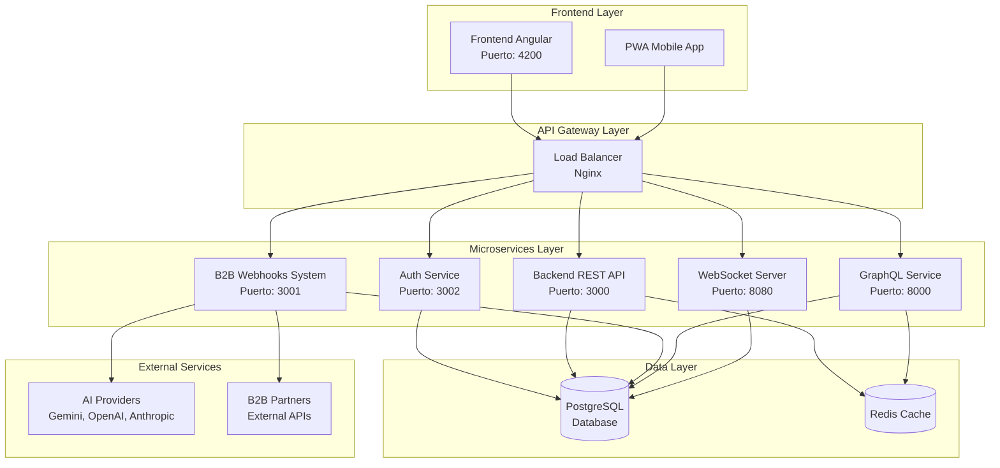
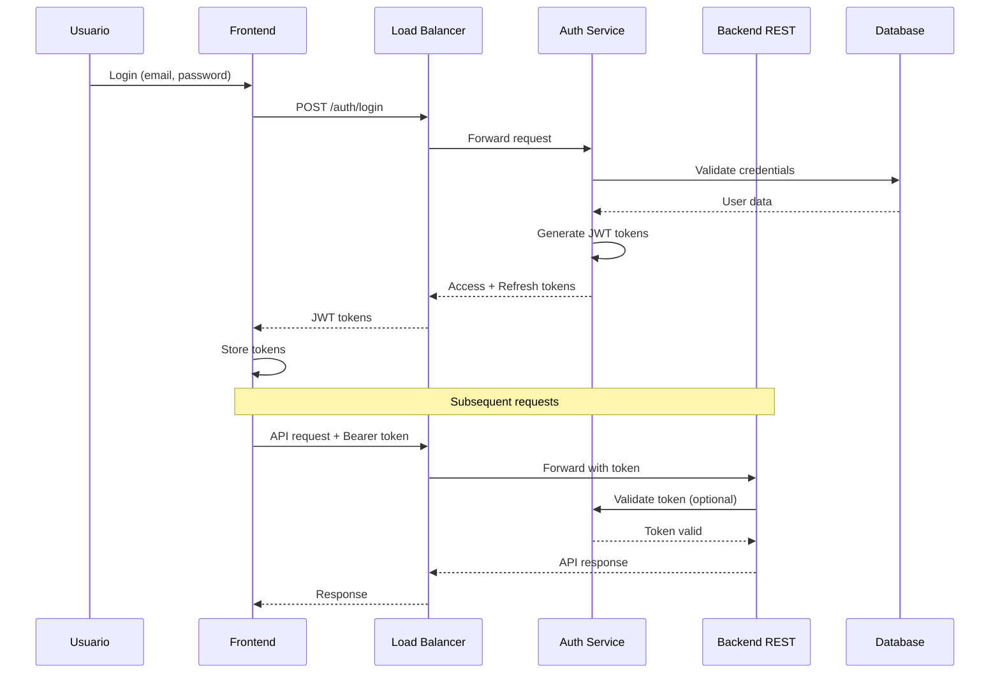
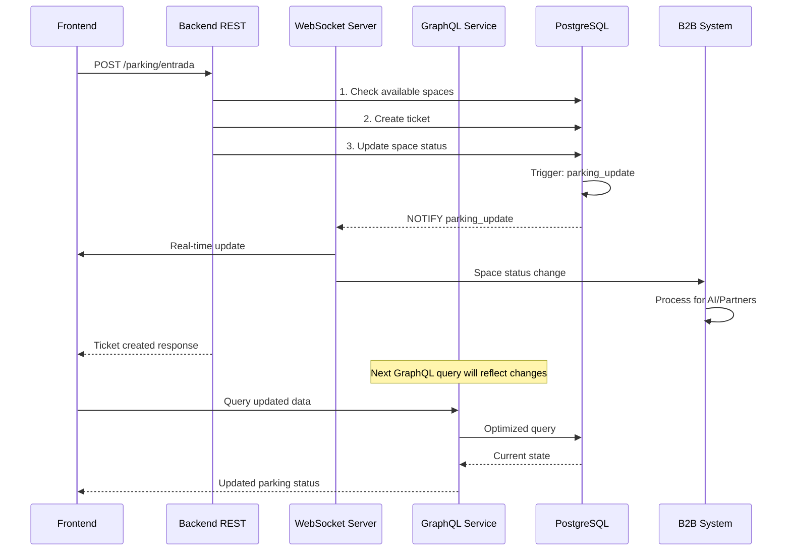
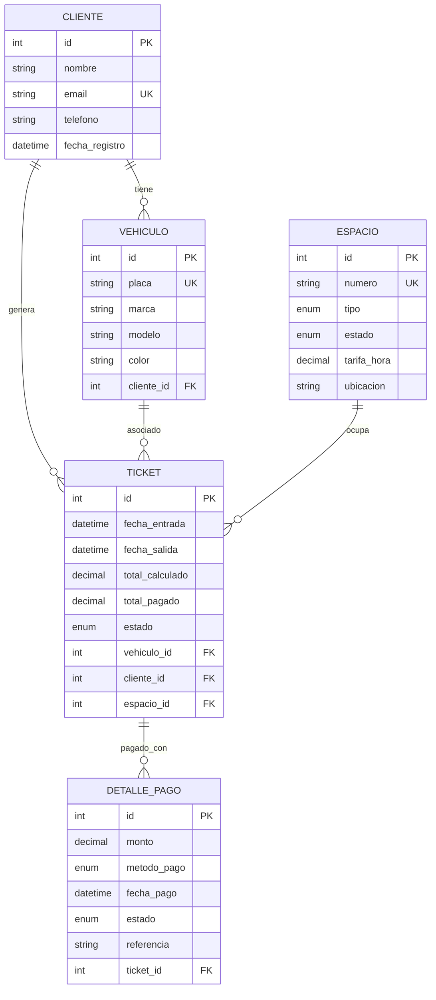
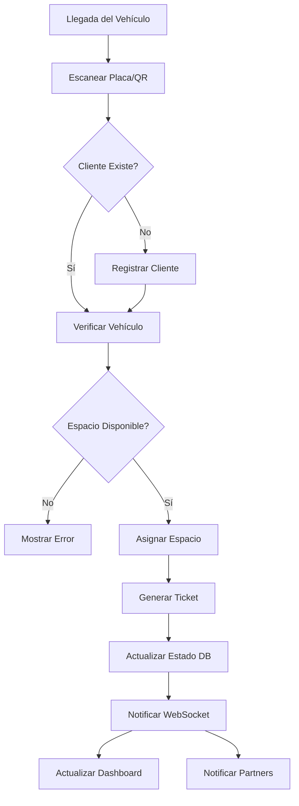
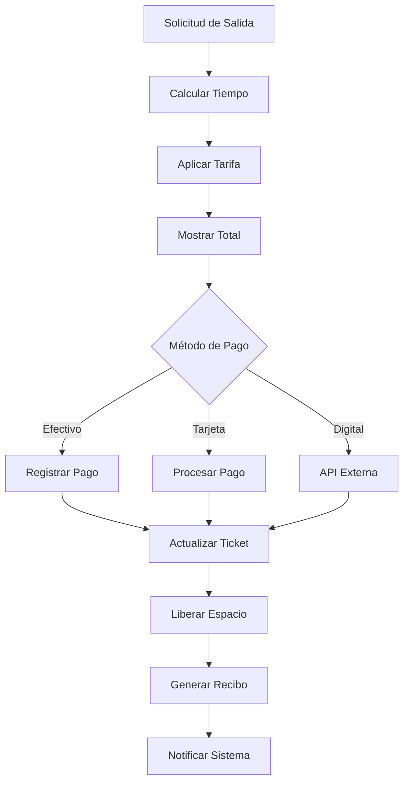
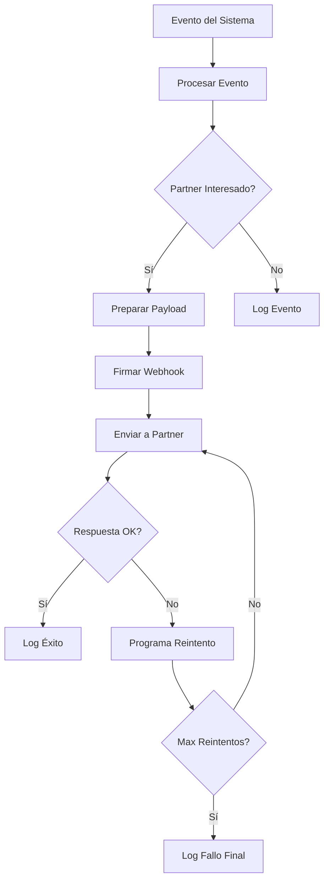

# 🗺️ Arquitectura General del Sistema - Sistema de Estacionamiento

> **Documentación completa de la arquitectura microservicios del sistema de gestión de estacionamiento**  
> Versión: 1.0 | Fecha: 21 de enero de 2026

---

## 📋 Visión General del Sistema

El **Sistema de Gestión de Estacionamiento** es una solución integral basada en **microservicios** que combina gestión tradicional de estacionamiento con capacidades avanzadas de IA, integraciones B2B y comunicación en tiempo real.

### 🎯 Objetivos del Sistema

- **Gestión eficiente** del estacionamiento en tiempo real
- **Experiencia de usuario** moderna y responsiva
- **Integración B2B** robusta con partners externos
- **IA conversacional** para soporte automatizado
- **Escalabilidad horizontal** para crecimiento futuro
- **Tiempo real** para actualizaciones inmediatas

---

## 🏛️ Arquitectura de Microservicios



---

## 🔄 Comunicación Entre Servicios

### 📡 Patrones de Comunicación

1. **Comunicación Síncrona**
   - **HTTP/REST** para operaciones CRUD
   - **GraphQL** para consultas optimizadas
   - **WebSockets** para tiempo real

2. **Comunicación Asíncrona**
   - **Database Triggers + LISTEN/NOTIFY** (PostgreSQL)
   - **Event-driven** architecture
   - **Message Queues** (futuro)

3. **Autenticación Distribuida**
   - **JWT tokens** compartidos
   - **Validación centralizada** en Auth Service
   - **Token propagation** entre servicios

---

## 🔐 Flujo de Autenticación



---

## 📊 Flujo de Datos Principal

### Registro de Entrada de Vehículo



---

## 🚀 Stack Tecnológico Completo

### Por Servicio

| Servicio | Tecnología Principal | Puerto | Base de Datos | Propósito |
|----------|---------------------|---------|---------------|-----------|
| **Frontend** | Angular 20 + TailwindCSS | 4200 | - | Interfaz de usuario |
| **Auth Service** | NestJS + JWT | 3002 | PostgreSQL | Autenticación |
| **Backend REST** | NestJS + TypeORM | 3000 | PostgreSQL | API principal |
| **B2B Webhooks** | NestJS + IA | 3001 | PostgreSQL | Integración + IA |
| **GraphQL** | Python + Strawberry | 8000 | PostgreSQL | Consultas optimizadas |
| **WebSocket** | Go + Gorilla | 8080 | PostgreSQL | Tiempo real |

### Dependencias Compartidas

- **Base de Datos**: PostgreSQL (Supabase)
- **Containerización**: Docker + Docker Compose
- **Proxy**: Nginx
- **Monitoreo**: Health checks integrados
- **Documentación**: Swagger/OpenAPI

---

## 🔀 Matriz de Dependencias

### Servicios Consumidores → Proveedores

```
┌─────────────────┐    ┌──────────────────┐
│   Frontend      │───▶│  Auth Service    │
│   Angular       │    │  (JWT Tokens)    │
└─────────────────┘    └──────────────────┘
         │
         ▼
┌─────────────────┐    ┌──────────────────┐
│  Backend REST   │───▶│   PostgreSQL     │
│  (Main API)     │    │   (Database)     │
└─────────────────┘    └──────────────────┘
         │
         ▼
┌─────────────────┐    ┌──────────────────┐
│ GraphQL Service │───▶│   PostgreSQL     │
│ (Optimized)     │    │   (Database)     │
└─────────────────┘    └──────────────────┘
         │
         ▼
┌─────────────────┐    ┌──────────────────┐
│ WebSocket Server│───▶│   PostgreSQL     │
│ (Real-time)     │    │   (LISTEN/NOTIFY) │
└─────────────────┘    └──────────────────┘
         │
         ▼
┌─────────────────┐    ┌──────────────────┐
│ B2B Webhooks    │───▶│  AI Providers    │
│ (IA + Partners) │    │  (Gemini, etc.)  │
└─────────────────┘    └──────────────────┘
```

---

## 🔄 Eventos y Notificaciones

### Sistema de Eventos en Tiempo Real

1. **Database Triggers** 🔄
   ```sql
   -- Trigger para cambios en espacios
   CREATE TRIGGER parking_space_change
   AFTER UPDATE ON espacios
   FOR EACH ROW
   EXECUTE FUNCTION notify_space_change();
   
   -- Trigger para nuevos tickets
   CREATE TRIGGER new_ticket_created
   AFTER INSERT ON tickets
   FOR EACH ROW
   EXECUTE FUNCTION notify_new_ticket();
   ```

2. **WebSocket Broadcasting** 📡
   - Cambios de estado de espacios
   - Nuevos tickets generados
   - Pagos completados
   - Alertas del sistema

3. **B2B Webhook Delivery** 🤝
   - Notificaciones a partners externos
   - Eventos de facturación
   - Reportes automáticos

---

## 🗄️ Modelo de Datos Unificado

### Entidades Principales



---

## 🚀 Flujos de Trabajo Principales

### 1. Flujo de Entrada de Vehículo



### 2. Flujo de Procesamiento de Pago



### 3. Flujo de Integración B2B



---

## 📊 Métricas y Monitoreo

### Health Checks por Servicio

| Servicio | Endpoint | Puerto | Verifica |
|----------|----------|---------|----------|
| Auth Service | `/health` | 3002 | DB connection, JWT |
| Backend REST | `/api/health` | 3000 | DB, Cache, APIs |
| B2B Webhooks | `/health/ai` | 3001 | AI providers, DB |
| GraphQL | `/health` | 8000 | DB connection |
| WebSocket | `/health` | 8080 | Connections, DB |

### Métricas de Negocio

- **Ocupación en tiempo real**
- **Ingresos por hora/día**
- **Tiempo promedio de estadía**
- **Métodos de pago preferidos**
- **Eficiencia operativa**

---

## 🔧 Configuración de Desarrollo

### Docker Compose Development

```yaml
# docker-compose.yml (simplificado)
version: '3.8'

services:
  # Base de datos compartida
  postgres:
    image: postgres:15
    environment:
      POSTGRES_DB: parking_db
      POSTGRES_USER: postgres
      POSTGRES_PASSWORD: password
    ports:
      - "5432:5432"
    networks:
      - parking-network

  # Servicios del sistema
  auth-service:
    build: ./auth-service
    ports: ["3002:3002"]
    depends_on: [postgres]
    
  backend-rest:
    build: ./backend-rest/API - copia
    ports: ["3000:3000"]
    depends_on: [postgres, auth-service]
    
  b2b-webhooks:
    build: ./b2b-webhooks-system
    ports: ["3001:3001"]
    depends_on: [postgres]
    
  graphql-service:
    build: ./graphql-service
    ports: ["8000:8000"]
    depends_on: [postgres]
    
  websocket-server:
    build: ./websocket-server
    ports: ["8080:8080"]
    depends_on: [postgres]
    
  frontend:
    build: ./frontend/Frontend
    ports: ["4200:80"]
    depends_on:
      - auth-service
      - backend-rest
      - b2b-webhooks
      - graphql-service
      - websocket-server

networks:
  parking-network:
    driver: bridge
```

---

## 🚀 Comandos de Orquestación

### Desarrollo Local
```bash
# Levantar todos los servicios
docker-compose up -d

# Ver logs de todos los servicios
docker-compose logs -f

# Parar todos los servicios
docker-compose down

# Rebuild específico
docker-compose up --build auth-service

# Logs de servicio específico
docker-compose logs -f backend-rest
```

### Base de Datos
```bash
# Ejecutar migraciones
docker-compose exec backend-rest npm run typeorm:migration:run

# Seed de datos inicial
docker-compose exec backend-rest npm run seed

# Backup de base de datos
docker-compose exec postgres pg_dump -U postgres parking_db > backup.sql
```

---

## 📈 Escalabilidad y Performance

### Consideraciones de Escalabilidad

1. **Horizontal Scaling** 📈
   - Cada microservicio puede escalarse independientemente
   - Load balancing con Nginx
   - Database read replicas

2. **Caching Strategy** ⚡
   - Redis para cache de sesiones
   - Apollo Client cache en frontend
   - Query result caching en GraphQL

3. **Database Optimization** 🗄️
   - Índices optimizados
   - Connection pooling
   - Query optimization

4. **Resource Management** 💾
   - Container resource limits
   - Memory optimization
   - CPU utilization monitoring

---

## 🔐 Seguridad Integral

### Capas de Seguridad

1. **Autenticación** 🔑
   - JWT tokens con expiración
   - Refresh token rotation
   - Rate limiting por usuario

2. **Autorización** 🛡️
   - Role-based access control
   - Permissions granulares
   - API key management

3. **Comunicación** 🔒
   - HTTPS en producción
   - WebSocket secure (WSS)
   - API signature verification

4. **Data Protection** 🔐
   - Encryption at rest
   - Sensitive data hashing
   - GDPR compliance

---

## 🎯 Casos de Uso del Sistema

### Usuarios Finales

1. **Operadores del Estacionamiento** 👨‍💼
   - Gestión diaria de espacios
   - Monitoreo en tiempo real
   - Generación de reportes

2. **Clientes del Estacionamiento** 👤
   - Reserva de espacios (futuro)
   - Historial de visitas
   - Pagos automatizados

3. **Administradores** 👨‍💻
   - Configuración del sistema
   - Gestión de usuarios
   - Análisis de datos

### Integraciones B2B

1. **Partners Comerciales** 🤝
   - Notificaciones de eventos
   - Datos de facturación
   - APIs de integración

2. **Sistemas Externos** 🔗
   - ERPs empresariales
   - Sistemas de pagos
   - Plataformas de movilidad

---

## 📋 Roadmap y Futuras Mejoras

### Corto Plazo (Q1 2026)
- [ ] Mobile app nativa
- [ ] Reservas anticipadas
- [ ] Integración con sistemas de pago externos
- [ ] Analytics avanzados

### Mediano Plazo (Q2-Q3 2026)
- [ ] Machine Learning para predicción de ocupación
- [ ] Sistema de loyalty points
- [ ] Integración con navegadores GPS
- [ ] API marketplace para partners

### Largo Plazo (Q4 2026+)
- [ ] IoT sensors para detección automática
- [ ] Blockchain para transparencia de pagos
- [ ] IA predictiva para optimización de precios
- [ ] Expansión multi-tenant

---

## 📞 Contacto y Soporte

### Documentación Adicional

- [AUTH-SERVICE.md](AUTH-SERVICE.md) - Servicio de autenticación
- [BACKEND-REST.md](BACKEND-REST.md) - API REST principal
- [B2B-WEBHOOKS-SYSTEM.md](B2B-WEBHOOKS-SYSTEM.md) - Sistema B2B y IA
- [GRAPHQL-SERVICE.md](GRAPHQL-SERVICE.md) - Servicio GraphQL
- [WEBSOCKET-SERVER.md](WEBSOCKET-SERVER.md) - Servidor WebSocket
- [FRONTEND-ANGULAR.md](FRONTEND-ANGULAR.md) - Frontend Angular

### Contribución al Proyecto

1. Fork del repositorio
2. Crear branch para feature
3. Desarrollar con tests
4. Pull request con documentación
5. Code review y merge

---

**Última actualización**: 21 de enero de 2026  
**Versión**: 1.0  
**Mantenido por**: Equipo de Desarrollo del Sistema de Estacionamiento