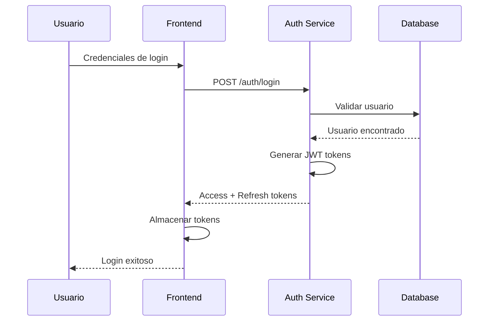

# 🔐 Auth Service - Servicio de Autenticación

> **Microservicio de autenticación independiente para el sistema de gestión de estacionamiento**  
> Puerto: 3002 | Tecnología: NestJS + TypeScript + JWT

---

## 📋 Descripción General

El **Auth Service** es un microservicio especializado en la gestión de autenticación y autorización del sistema de estacionamiento. Proporciona un sistema de autenticación basado en JWT (JSON Web Tokens) con capacidades de refresh tokens, rate limiting y validación robusta.

### 🎯 Responsabilidades Principales

- **Autenticación de usuarios** (login/logout)
- **Registro de nuevos usuarios**
- **Gestión de tokens JWT** (access + refresh tokens)
- **Validación de credenciales**
- **Rate limiting** para prevenir ataques de fuerza bruta
- **Health checks** para monitoreo del servicio

---

## 🏗️ Arquitectura Interna

### Módulos Principales
```
auth-service/
├── src/
│   ├── modules/
│   │   ├── auth/          # Lógica de autenticación
│   │   ├── users/         # Gestión de usuarios
│   │   ├── tokens/        # Manejo de JWT tokens
│   │   └── health/        # Health checks
│   └── shared/
│       └── jwt-local-validator.ts  # Validador JWT reutilizable
```

### Tecnologías Utilizadas
- **Framework**: NestJS (TypeScript)
- **Base de Datos**: PostgreSQL
- **ORM**: TypeORM
- **Autenticación**: JWT + Passport
- **Validación**: class-validator
- **Documentación**: Swagger/OpenAPI
- **Seguridad**: bcryptjs, rate limiting

---

## 🔄 Relaciones con Otros Servicios

### 📤 Servicios que CONSUMEN Auth Service

1. **Frontend (Angular)**
   - Consume endpoints de login/register
   - Almacena y gestiona tokens JWT
   - Realiza autenticación de usuarios

2. **B2B Webhooks System**
   - Valida tokens para endpoints protegidos
   - Utiliza el validador JWT compartido
   - Verifica permisos de usuarios empresariales

3. **Backend REST API**
   - Valida tokens en cada request protegido
   - Obtiene información del usuario autenticado
   - Implementa autorización basada en roles

### 📥 Servicios que Auth Service CONSUME

1. **Base de Datos PostgreSQL (Supabase)**
   - Almacena usuarios y credenciales
   - Gestiona sesiones activas
   - Mantiene logs de autenticación

---

## 🚀 Endpoints Principales

### Autenticación
```typescript
POST /auth/login           # Iniciar sesión
POST /auth/register        # Registrar usuario
POST /auth/refresh         # Renovar token
POST /auth/logout          # Cerrar sesión
```

### Gestión de Usuarios
```typescript
GET  /users/profile        # Obtener perfil del usuario
PUT  /users/profile        # Actualizar perfil
GET  /users/:id           # Obtener usuario por ID (admin)
```

### Tokens
```typescript
POST /tokens/validate      # Validar token JWT
POST /tokens/revoke       # Revocar token
```

### Salud del Servicio
```typescript
GET  /health              # Health check
```

---

## 🔧 Variables de Entorno

```env
# Configuración del Servicio
NODE_ENV=development
PORT=3002

# Base de Datos
DB_HOST=your-db-host
DB_PORT=5432
DB_USERNAME=your-username
DB_PASSWORD=your-password
DB_DATABASE=postgres
DB_SSL=true

# JWT Configuration
JWT_SECRET=your-super-secret-key
JWT_ACCESS_EXPIRATION=15m
JWT_REFRESH_EXPIRATION=7d

# Rate Limiting
RATE_LIMIT_TTL=60        # Tiempo en segundos
RATE_LIMIT_MAX=10        # Máximo de requests por TTL
```

---

## 🛡️ Características de Seguridad

### Rate Limiting
- **10 requests por minuto** por IP
- Protección contra ataques de fuerza bruta
- Configuración personalizable

### JWT Security
- **Access tokens** de corta duración (15 minutos)
- **Refresh tokens** de larga duración (7 días)
- Algoritmo HS256 para firmado
- Validación automática en cada request

### Encriptación
- **bcryptjs** para hash de contraseñas
- Salt rounds configurables
- Validación robusta de credenciales

---

## 📊 Flujo de Autenticación



---

## 🔍 Health Checks y Monitoreo

### Health Check Endpoint
```bash
curl -f http://localhost:3002/health
```

### Docker Health Check
```yaml
healthcheck:
  test: ["CMD", "curl", "-f", "http://localhost:3002/health"]
  interval: 30s
  timeout: 10s
  retries: 3
```

---

## 🚀 Comandos de Desarrollo

```bash
# Instalar dependencias
npm install

# Desarrollo con hot reload
npm run start:dev

# Build para producción
npm run build

# Ejecutar tests
npm run test

# Linting
npm run lint
```

---

## 📝 Archivo de Configuración Compartido

El servicio incluye un validador JWT reutilizable:

**`shared/jwt-local-validator.ts`**
- Validación de tokens sin dependencias de NestJS
- Reutilizable en otros microservicios
- Manejo de errores centralizado
- Compatible con cualquier framework Node.js

---

## 🔗 Integración con Otros Servicios

### Uso en otros microservicios
```typescript
import { JwtLocalValidator } from './shared/jwt-local-validator';

const validator = new JwtLocalValidator(JWT_SECRET);
const payload = await validator.validateToken(token);
```

### Headers requeridos
```http
Authorization: Bearer <jwt-token>
```

---

## 📈 Métricas y Logs

- **Logs de autenticación** exitosa/fallida
- **Métricas de rate limiting**
- **Health status** del servicio
- **Conexión a base de datos**
- **Tiempo de respuesta** de endpoints