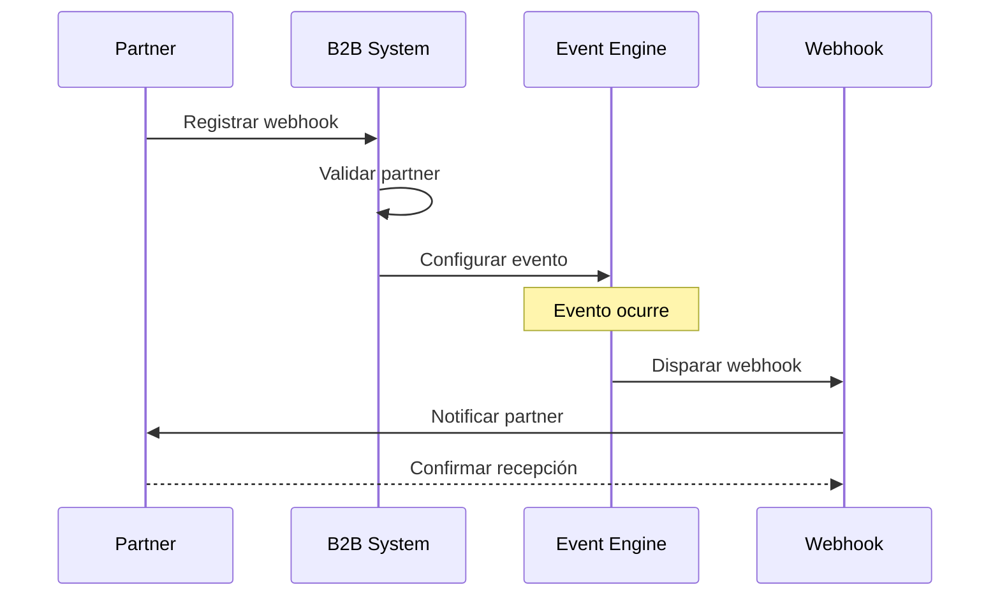

# 🤖 B2B Webhooks System - Sistema de Integración Empresarial

> **Sistema avanzado de webhooks con IA integrada y Model Context Protocol (MCP)**  
> Puerto: 3001 | Tecnología: NestJS + TypeScript + IA Multimodal

---

## 📋 Descripción General

El **B2B Webhooks System** es el núcleo inteligente del sistema de estacionamiento, diseñado para integrar socios comerciales y proporcionar capacidades avanzadas de IA. Este sistema combina webhooks tradicionales con un chatbot inteligente que utiliza el protocolo MCP (Model Context Protocol) para interacciones multimodales.

### 🎯 Características Principales

- **Sistema de webhooks** para integración B2B
- **Chatbot inteligente** con soporte MCP
- **IA multimodal** (texto, imágenes, PDFs, audio)
- **Múltiples proveedores de IA** (Gemini, OpenAI, Anthropic)
- **Motor de eventos** robusto
- **Gestión de partners** empresariales
- **Procesamiento de pagos** integrado

---

## 🏗️ Arquitectura Modular

### Estructura del Sistema
```
b2b-webhooks-system/
├── src/
│   ├── ai/                    # 🧠 Módulo de Inteligencia Artificial
│   │   ├── ai-orchestrator.service.ts
│   │   ├── gemini-adapter.service.ts
│   │   ├── llm-strategy.service.ts
│   │   └── providers/         # Proveedores de IA
│   ├── mcp/                   # 🔌 Model Context Protocol
│   │   ├── business-tools.service.ts
│   │   ├── mcp-tools.service.ts
│   │   └── mcp.controller.ts
│   ├── partners/              # 🤝 Gestión de Partners B2B
│   ├── events/                # ⚡ Motor de Eventos
│   ├── payments/              # 💳 Procesamiento de Pagos
│   ├── webhooks/              # 🔗 Sistema de Webhooks
│   └── shared/                # 📚 Utilidades Compartidas
```

---

## 🧠 Módulo AI - Inteligencia Artificial

### Características del Sistema de IA

1. **AI Orchestrator** 🎯
   - Coordina múltiples proveedores de IA
   - Selección automática del mejor proveedor
   - Fallback entre proveedores
   - Cache inteligente de respuestas

2. **LLM Strategy Service** 🔄
   - Patrón Strategy para diferentes modelos
   - Configuración dinámica de proveedores
   - Balanceeo de carga automático
   - Gestión de costos por modelo

3. **Multimodal Processor** 📸
   - Procesamiento de imágenes
   - Análisis de PDFs
   - Transcripción de audio
   - Extracción de texto OCR

### Proveedores Soportados
```typescript
// Proveedores de IA disponibles
enum AIProvider {
  GEMINI = 'gemini',        // Google Gemini Pro/Vision
  OPENAI = 'openai',        // GPT-4, GPT-4-Vision
  ANTHROPIC = 'anthropic'   // Claude 3 Sonnet/Opus
}
```

---

## 🔌 Model Context Protocol (MCP)

### ¿Qué es MCP?
El **Model Context Protocol** es un estándar abierto que permite a los modelos de IA acceder a herramientas y contexto de manera segura y estructurada.

### Herramientas Empresariales Disponibles

1. **Business Tools** 💼
   - Consultas de estacionamiento en tiempo real
   - Generación de reportes automáticos
   - Gestión de reservas inteligente
   - Análisis de ocupación

2. **MCP Tools** 🛠️
   - Herramientas de consulta de datos
   - Integración con APIs externas
   - Automatización de procesos
   - Gestión de workflows

### Ejemplo de Interacción MCP
```typescript
// El chatbot puede ejecutar herramientas empresariales
const result = await mcpService.executeTool('parking_status', {
  location: 'downtown',
  date: '2026-01-21'
});
```

---

## 🔄 Relaciones con Otros Servicios

### 📤 Servicios que B2B Webhooks CONSUME

1. **Auth Service**
   - Validación de tokens JWT
   - Autorización de usuarios empresariales
   - Verificación de permisos

2. **GraphQL Service**
   - Consultas complejas de datos
   - Suscripciones en tiempo real
   - Optimización de queries

3. **Backend REST API**
   - CRUD de datos de estacionamiento
   - Gestión de transacciones
   - Sincronización de estados

4. **WebSocket Server**
   - Notificaciones en tiempo real
   - Updates de estado
   - Comunicación bidireccional

### 📥 Servicios que CONSUMEN B2B Webhooks

1. **Frontend Angular**
   - Interacciones con chatbot
   - Configuración de webhooks
   - Dashboard de IA

2. **Partners Externos**
   - Recepción de webhooks
   - Integración B2B
   - Datos de facturación

---

## 🚀 Endpoints Principales

### MCP Chatbot
```typescript
POST /mcp/chat                 # Interacción con chatbot
POST /mcp/upload              # Subir archivos multimodales
GET  /mcp/tools               # Lista de herramientas disponibles
POST /mcp/execute-tool        # Ejecutar herramienta específica
```

### Webhooks
```typescript
POST /webhooks/register       # Registrar webhook
PUT  /webhooks/:id           # Actualizar webhook
DELETE /webhooks/:id         # Eliminar webhook
POST /webhooks/test          # Probar webhook
```

### Partners
```typescript
GET  /partners               # Lista de partners
POST /partners               # Crear partner
PUT  /partners/:id          # Actualizar partner
GET  /partners/:id/stats    # Estadísticas del partner
```

### Events
```typescript
POST /events/trigger         # Disparar evento
GET  /events/history        # Historial de eventos
PUT  /events/config         # Configurar eventos
```

---

## 🔧 Variables de Entorno

```env
# Configuración del Servicio
NODE_ENV=development
PORT=3001

# Base de Datos
DB_HOST=your-db-host
DB_PORT=5432
DB_USERNAME=your-username
DB_PASSWORD=your-password
DB_DATABASE=postgres

# IA Providers
GEMINI_API_KEY=your-gemini-key
OPENAI_API_KEY=your-openai-key
ANTHROPIC_API_KEY=your-anthropic-key

# MCP Configuration
MCP_TOOLS_ENABLED=true
MCP_MAX_CONTEXT_LENGTH=32000
MCP_DEFAULT_PROVIDER=gemini

# Webhooks
WEBHOOK_SECRET=your-webhook-secret
WEBHOOK_RETRY_ATTEMPTS=3
WEBHOOK_TIMEOUT=30000

# File Upload
MAX_FILE_SIZE=50MB
ALLOWED_MIME_TYPES=image/*,application/pdf,audio/*

# Rate Limiting
RATE_LIMIT_TTL=60
RATE_LIMIT_MAX=100
```

---

## 🤖 Capacidades del Chatbot

### Procesamiento Multimodal

1. **Imágenes** 📷
   ```typescript
   // Análisis de imágenes de estacionamiento
   "Analiza esta foto del estacionamiento y dime cuántos espacios están libres"
   ```

2. **PDFs** 📄
   ```typescript
   // Extracción de datos de contratos
   "Extrae los términos del contrato de este PDF"
   ```

3. **Audio** 🎵
   ```typescript
   // Transcripción de llamadas de soporte
   "Transcribe esta llamada de servicio al cliente"
   ```

### Herramientas Empresariales

- **Consultas en tiempo real** del estado del estacionamiento
- **Generación de reportes** automáticos
- **Análisis predictivo** de ocupación
- **Gestión automática** de reservas
- **Procesamiento de quejas** y solicitudes

---

## 📊 Flujo de Webhooks B2B



---

## 🎯 Casos de Uso Principales

### 1. Integración de Partners
```typescript
// Partner registra webhook para notificaciones
{
  "url": "https://partner.com/webhook",
  "events": ["parking.occupied", "payment.completed"],
  "secret": "partner-secret"
}
```

### 2. Chatbot Inteligente
```typescript
// Usuario interactúa con IA
Usuario: "¿Cuántos espacios libres hay en el centro?"
IA: "Consultando estado actual... Hay 23 espacios libres de 100 total en zona centro."
```

### 3. Procesamiento Multimodal
```typescript
// Subida de imagen para análisis
POST /mcp/upload
Content-Type: multipart/form-data

{
  "file": [imagen del estacionamiento],
  "prompt": "Cuenta los vehículos en esta imagen"
}
```

---

## 🔍 Monitoreo y Métricas

### Métricas de IA
- **Tiempo de respuesta** por proveedor
- **Costo por consulta** y optimización
- **Accuracy** de respuestas
- **Uso de herramientas** MCP

### Métricas de Webhooks
- **Delivery rate** de webhooks
- **Tiempo de respuesta** de partners
- **Reintentos** y fallos
- **Volumen** de eventos

### Health Checks
```bash
GET /health/ai        # Estado de proveedores de IA
GET /health/mcp       # Estado del sistema MCP
GET /health/webhooks  # Estado de webhooks
```

---

## 🚀 Despliegue y Escalabilidad

### Docker Configuration
```dockerfile
# Optimizado para cargas de trabajo de IA
FROM node:18-alpine
WORKDIR /app
COPY . .
RUN npm ci --only=production
EXPOSE 3001
CMD ["npm", "run", "start:prod"]
```

### Escalabilidad
- **Load balancing** automático entre proveedores de IA
- **Cache distribuido** para respuestas frecuentes
- **Rate limiting** inteligente por partner
- **Queue system** para procesamiento asíncrono

---

## 🔐 Seguridad y Compliance

### Autenticación
- **JWT tokens** validados con Auth Service
- **API keys** para partners externos
- **Webhook signatures** para verificación

### Data Privacy
- **Encriptación** de datos sensibles
- **Anonymización** de logs
- **GDPR compliance** para datos de usuarios
- **Retention policies** configurables