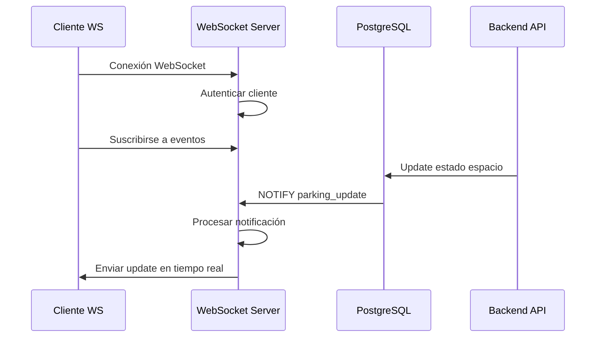

# ⚡ WebSocket Server - Comunicación en Tiempo Real

> **Servidor WebSocket de alto rendimiento para notificaciones en tiempo real**  
> Puerto: 8080 | Tecnología: Go + Gorilla WebSocket + PostgreSQL

---

## 📋 Descripción General

El **WebSocket Server** es un servicio especializado en comunicación bidireccional en tiempo real, desarrollado en Go para máximo rendimiento y concurrencia. Proporciona notificaciones instantáneas sobre cambios en el estado del estacionamiento, actualizaciones de ocupación y eventos del sistema.

### 🎯 Características Principales

- **Comunicación bidireccional** en tiempo real
- **Alta concurrencia** con Go goroutines
- **Notificaciones push** instantáneas
- **Conexiones persistentes** optimizadas
- **Escalabilidad horizontal** nativa
- **Reconexión automática** del cliente

---

## 🏗️ Arquitectura del Servidor

### Estructura del Proyecto
```
websocket-server/
├── cmd/
│   └── server/              # 🚀 Punto de entrada
│       └── main.go
├── internal/
│   ├── client/              # 👤 Gestión de clientes
│   │   └── client.go
│   ├── config/              # ⚙️ Configuración
│   │   └── config.go
│   ├── domain/              # 🎯 Modelos de dominio
│   │   └── models.go
│   ├── handler/             # 🔄 Manejadores WebSocket
│   │   └── websocket.go
│   ├── repository/          # 💾 Acceso a datos
│   │   └── database.go
│   └── service/             # 🔧 Lógica de negocio
│       └── notification.go
├── pkg/
│   └── database/            # 🗄️ Conexión DB
│       └── postgres.go
├── go.mod                   # 📦 Dependencias Go
└── Dockerfile              # 🐳 Containerización
```

### Stack Tecnológico
- **Lenguaje**: Go 1.21+
- **WebSocket**: Gorilla WebSocket
- **Base de Datos**: PostgreSQL
- **Configuración**: godotenv
- **Concurrencia**: Go goroutines y channels

---

## 🔄 Tipos de Mensajes WebSocket

### 1. Notificaciones de Estacionamiento 🅿️
```json
{
  "type": "parking_update",
  "data": {
    "espacio_id": 15,
    "numero": "A-15",
    "estado_anterior": "libre",
    "estado_actual": "ocupado",
    "timestamp": "2026-01-21T10:30:00Z",
    "vehiculo": {
      "placa": "ABC123",
      "cliente": "Juan Pérez"
    }
  }
}
```

### 2. Nuevos Tickets 🎫
```json
{
  "type": "new_ticket",
  "data": {
    "ticket_id": 789,
    "vehiculo": "XYZ789",
    "espacio": "B-08",
    "fecha_entrada": "2026-01-21T10:30:00Z",
    "cliente": "María García"
  }
}
```

### 3. Pagos Completados 💳
```json
{
  "type": "payment_completed",
  "data": {
    "ticket_id": 789,
    "monto": 15.50,
    "metodo_pago": "tarjeta",
    "fecha_pago": "2026-01-21T12:45:00Z"
  }
}
```

### 4. Alertas del Sistema 🚨
```json
{
  "type": "system_alert",
  "data": {
    "level": "warning",
    "message": "Estacionamiento casi lleno (95% ocupado)",
    "timestamp": "2026-01-21T14:20:00Z",
    "action_required": false
  }
}
```

### 5. Estadísticas en Tiempo Real 📊
```json
{
  "type": "stats_update",
  "data": {
    "espacios_total": 200,
    "espacios_libres": 23,
    "espacios_ocupados": 177,
    "ingresos_dia": 1250.75,
    "timestamp": "2026-01-21T15:00:00Z"
  }
}
```

---

## 🔄 Relaciones con Otros Servicios

### 📤 Servicios que CONSUMEN WebSocket Server

1. **Frontend Angular** 🖥️
   - Dashboard en tiempo real
   - Notificaciones de usuario
   - Updates de estado automáticos
   - Indicadores de disponibilidad

2. **B2B Webhooks System** 🤖
   - Notificaciones para chatbot
   - Updates para herramientas MCP
   - Eventos para partners

3. **Apps Móviles** 📱
   - Notificaciones push
   - Estado de reservas
   - Alertas de vencimiento

### 📥 Servicios que WebSocket Server CONSUME

1. **Base de Datos PostgreSQL** 🗄️
   - Listen/Notify para eventos DB
   - Consultas de estado
   - Logs de eventos

2. **Backend REST API** 📡
   - Eventos de cambio de estado
   - Nuevas transacciones
   - Updates de datos

---

## ⚡ Gestión de Conexiones

### Client Manager en Go
```go
type ClientManager struct {
    clients    map[*Client]bool
    broadcast  chan []byte
    register   chan *Client
    unregister chan *Client
    mutex      sync.RWMutex
}

func (manager *ClientManager) Run() {
    for {
        select {
        case client := <-manager.register:
            manager.addClient(client)
            
        case client := <-manager.unregister:
            manager.removeClient(client)
            
        case message := <-manager.broadcast:
            manager.broadcastMessage(message)
        }
    }
}
```

### Manejo de Cliente
```go
type Client struct {
    ID         string
    conn       *websocket.Conn
    send       chan []byte
    manager    *ClientManager
    userID     string
    filters    []string  // Filtros de suscripción
}

func (c *Client) WritePump() {
    defer c.conn.Close()
    for {
        select {
        case message := <-c.send:
            if err := c.conn.WriteMessage(websocket.TextMessage, message); err != nil {
                return
            }
        }
    }
}
```

---

## 🚀 Endpoints WebSocket

### Conexión Principal
```
ws://localhost:8080/ws
```

### Autenticación
```go
// Headers requeridos para autenticación
headers := http.Header{
    "Authorization": {"Bearer " + jwtToken},
    "User-Id":       {userId},
}
```

### Suscripciones Selectivas
```json
// Mensaje de suscripción del cliente
{
  "action": "subscribe",
  "filters": [
    "parking_updates",
    "payments",
    "alerts"
  ]
}
```

---

## 📊 Sistema de Notificaciones

### PostgreSQL Listen/Notify
```sql
-- Trigger para notificaciones de cambio de estado
CREATE OR REPLACE FUNCTION notify_parking_change()
RETURNS trigger AS $$
BEGIN
    PERFORM pg_notify('parking_update', 
        json_build_object(
            'espacio_id', NEW.id,
            'estado_anterior', OLD.estado,
            'estado_actual', NEW.estado,
            'timestamp', NOW()
        )::text
    );
    RETURN NEW;
END;
$$ LANGUAGE plpgsql;

CREATE TRIGGER parking_state_change
    AFTER UPDATE ON espacios
    FOR EACH ROW
    EXECUTE FUNCTION notify_parking_change();
```

### Listener en Go
```go
func (n *NotificationService) Listen() {
    listener := pq.NewListener(n.databaseURL, 10*time.Second, time.Minute, nil)
    err := listener.Listen("parking_update")
    if err != nil {
        log.Fatal(err)
    }
    
    for {
        notification := <-listener.Notify
        if notification != nil {
            n.processNotification(notification)
        }
    }
}
```

---

## 🔧 Configuración y Variables de Entorno

```env
# Servidor WebSocket
WS_HOST=0.0.0.0
WS_PORT=8080
WS_READ_BUFFER_SIZE=1024
WS_WRITE_BUFFER_SIZE=1024

# Base de Datos
DB_HOST=localhost
DB_PORT=5432
DB_USER=postgres
DB_PASSWORD=password
DB_NAME=parking_db
DB_SSL_MODE=disable

# Autenticación
JWT_SECRET=your-secret-key
AUTH_SERVICE_URL=http://localhost:3002

# Performance
MAX_CONNECTIONS=1000
PING_PERIOD=54s
WRITE_WAIT=10s
PONG_WAIT=60s

# Logging
LOG_LEVEL=info
LOG_FORMAT=json
```

---

## 🚀 Características de Performance

### Concurrencia en Go
- **Goroutines** para cada cliente
- **Channels** para comunicación segura
- **Connection pooling** de DB
- **Non-blocking I/O** nativo

### Optimizaciones
```go
// Configuración de WebSocket optimizada
var upgrader = websocket.Upgrader{
    ReadBufferSize:  1024,
    WriteBufferSize: 1024,
    CheckOrigin: func(r *http.Request) bool {
        return true // Configurar según necesidades
    },
}

// Timeouts y keepalive
const (
    writeWait      = 10 * time.Second
    pongWait       = 60 * time.Second
    pingPeriod     = (pongWait * 9) / 10
    maxMessageSize = 512
)
```

---

## 📈 Métricas y Monitoreo

### Métricas Disponibles
- **Conexiones activas** en tiempo real
- **Mensajes enviados** por segundo
- **Latencia promedio** de mensajes
- **Rate de desconexiones**
- **Uso de memoria** por conexión

### Health Check
```go
func healthCheck(w http.ResponseWriter, r *http.Request) {
    status := map[string]interface{}{
        "status":            "healthy",
        "active_connections": clientManager.GetConnectionCount(),
        "uptime":           time.Since(startTime),
        "version":          "1.0.0",
    }
    json.NewEncoder(w).Encode(status)
}
```

---

## 🔄 Flujo de Notificaciones



---

## 🛡️ Seguridad y Autenticación

### Validación JWT
```go
func validateJWT(token string) (*UserClaims, error) {
    parsedToken, err := jwt.ParseWithClaims(token, &UserClaims{}, func(token *jwt.Token) (interface{}, error) {
        return []byte(os.Getenv("JWT_SECRET")), nil
    })
    
    if claims, ok := parsedToken.Claims.(*UserClaims); ok && parsedToken.Valid {
        return claims, nil
    }
    
    return nil, err
}
```

### Rate Limiting
```go
type RateLimiter struct {
    clients map[string]*rate.Limiter
    mu      sync.RWMutex
}

func (rl *RateLimiter) Allow(clientID string) bool {
    rl.mu.RLock()
    limiter, exists := rl.clients[clientID]
    rl.mu.RUnlock()
    
    if !exists {
        rl.addClient(clientID)
        return true
    }
    
    return limiter.Allow()
}
```

---

## 🚀 Comandos de Desarrollo

```bash
# Instalar dependencias
go mod download

# Ejecutar en desarrollo
go run cmd/server/main.go

# Build para producción
go build -o bin/websocket-server cmd/server/main.go

# Tests
go test ./...

# Tests con cobertura
go test -cover ./...

# Linting
golangci-lint run
```

---

## 🐳 Docker y Despliegue

### Dockerfile Optimizado
```dockerfile
# Build stage
FROM golang:1.21-alpine AS builder
WORKDIR /app
COPY go.mod go.sum ./
RUN go mod download
COPY . .
RUN CGO_ENABLED=0 GOOS=linux go build -o main cmd/server/main.go

# Final stage
FROM alpine:latest
RUN apk --no-cache add ca-certificates
WORKDIR /root/
COPY --from=builder /app/main .
EXPOSE 8080
CMD ["./main"]
```

---

## 🔧 Ejemplos de Integración

### Cliente JavaScript
```javascript
class ParkingWebSocket {
    constructor(token) {
        this.token = token;
        this.ws = null;
        this.reconnectInterval = 5000;
    }
    
    connect() {
        const wsUrl = `ws://localhost:8080/ws`;
        this.ws = new WebSocket(wsUrl, [], {
            headers: {
                'Authorization': `Bearer ${this.token}`
            }
        });
        
        this.ws.onmessage = (event) => {
            const data = JSON.parse(event.data);
            this.handleMessage(data);
        };
        
        this.ws.onclose = () => {
            setTimeout(() => this.connect(), this.reconnectInterval);
        };
    }
    
    subscribe(filters) {
        const message = {
            action: 'subscribe',
            filters: filters
        };
        this.ws.send(JSON.stringify(message));
    }
}
```

### Angular Service
```typescript
@Injectable()
export class WebSocketService {
    private ws: WebSocket;
    private messageSubject = new Subject<any>();
    
    connect(token: string): void {
        this.ws = new WebSocket(`ws://localhost:8080/ws`);
        
        this.ws.onopen = () => {
            // Enviar token de autenticación
            this.send({ action: 'auth', token });
        };
        
        this.ws.onmessage = (event) => {
            const message = JSON.parse(event.data);
            this.messageSubject.next(message);
        };
    }
    
    getMessages(): Observable<any> {
        return this.messageSubject.asObservable();
    }
}
```

---

## 📊 Casos de Uso Principales

### 1. Dashboard en Tiempo Real
- Updates automáticos de disponibilidad
- Estadísticas dinámicas
- Alertas de sistema

### 2. Notificaciones de Usuario
- Confirmación de reservas
- Alertas de vencimiento
- Updates de pago

### 3. Integración B2B
- Notificaciones a partners
- Eventos de facturación
- Status de servicios

### 4. Monitoreo de Operaciones
- Alertas de capacidad
- Eventos de mantenimiento
- Métricas de performance